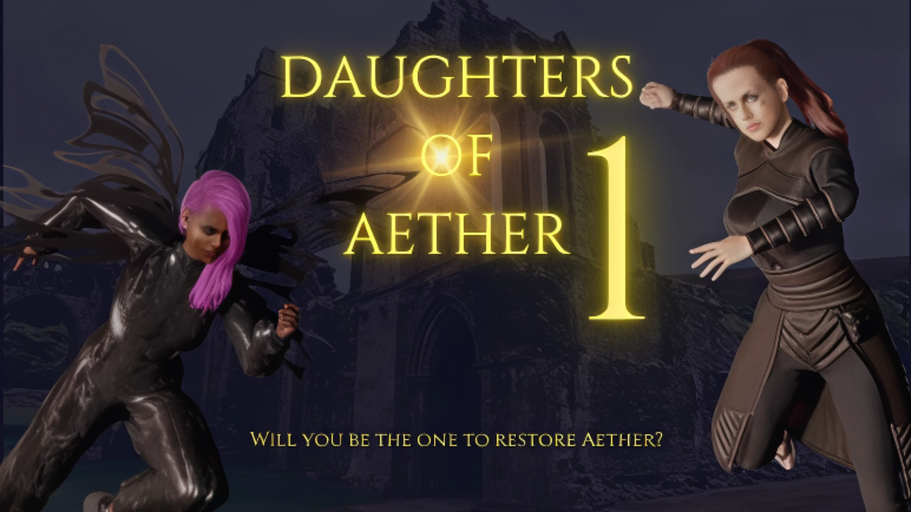

## Daughters of Aether – Project Overview & Setup Guide

Daughters of Aether is a real-time Web3 PvP arena game built on **Gorbagana testnet**, featuring:
- 3D character selection and battles
- On-chain staking and rewards on Gorbagana testnet
- Real-time matchmaking and multiplayer combat
- A modern, animated UI with wallet integration

## Play the Game

Try the live game here: [https://daughter-of-aether.vercel.app/](https://daughter-of-aether.vercel.app/)

**🎮 Gorbagana Testnet Version**: Connect your wallet to Gorbagana testnet to play with GOR tokens!

**✅ Compatible Wallets**: Backpack and Phantom work seamlessly. Solflare has known compatibility issues.

---

## Project Structure

This project is split into three main repositories:

- **Frontend UI:** [github.com/DavidNzube101/DOA-](https://github.com/DavidNzube101/DOA-)
  - Nuxt 3 + Vue 3 + Three.js game client
  - Wallet connection, 3D arena, matchmaking, and battle UI
  - **See the README in this repo for detailed setup and environment variable instructions.**

- **Backend Server:** [github.com/DavidNzube101/DOA-server-](https://github.com/DavidNzube101/DOA-server-)
  - Node.js + Socket.IO matchmaking and battle state server
  - Handles contract calls, player state, and auto-resolution
  - **See the README in this repo for deployment, environment, and security notes.**

- **Gorbagana Smart Contract:** [github.com/DavidNzube101/DOA-Contract](https://github.com/DavidNzube101/DOA-Contract)
  - Anchor-based Gorbagana program for battles, staking, and resolution
  - **Deployed on Gorbagana testnet** - see the README for build, deploy, and customization instructions.

---

## Game Overview

- **Connect your Gorbagana wallet** (Backpack or Phantom recommended, configured for Gorbagana testnet)
- **Select a character** and stake GOR tokens to enter the arena
- **Matchmaking** pairs you with another player in real time
- **Battle in a 3D arena** with health, mana, and special moves
- **Winner takes all**: the total stake pool is awarded to the victor
- **All results are settled on Gorbagana testnet** for transparency and fairness

---

## Gorbagana Testnet Setup

### Smart Contract Details
- **Program ID**: `GAB3CVmCbarpepefKNFEGEUGw6RzcMx9LSGER2Hg3FU2`
- **Explorer**: [https://explorer.gorbagana.wtf/address/GAB3CVmCbarpepefKNFEGEUGw6RzcMx9LSGER2Hg3FU2](https://explorer.gorbagana.wtf/address/GAB3CVmCbarpepefKNFEGEUGw6RzcMx9LSGER2Hg3FU2)

### Getting GOR Testnet Tokens
1. Visit [faucet.gorbagana.wtf](https://faucet.gorbagana.wtf) to get GOR tokens
2. Configure your wallet to connect to Gorbagana testnet
3. Ensure you have enough GOR for staking and transaction fees

### Wallet Compatibility
- ✅ **Backpack**: Fully compatible
- ✅ **Phantom**: Fully compatible  
- ❌ **Solflare**: Known compatibility issues

### Contract Deployment
The smart contract is deployed on Gorbagana testnet. See the contract repository for:
- Build and deployment instructions
- Transaction examples on Gorbagana explorer
- Integration guides for developers

---

## Local Setup

If you want to run Daughters of Aether locally (for development, testing, or hacking):

1. **Clone each repository:**
   - [Frontend UI](https://github.com/DavidNzube101/DOA-)
   - [Backend Server](https://github.com/DavidNzube101/DOA-server-)
   - [Gorbagana Contract](https://github.com/DavidNzube101/DOA-Contract)

2. **Follow the setup guides in each repo:**
   - Each repository contains a detailed README with environment variables, build steps, and troubleshooting.
   - The UI and server can be run locally with Node.js and pnpm.
   - The contract can be deployed to Gorbagana testnet (see contract README for deployment).

3. **Configure your environment:**
   - Set up `.env` files as described in each repo.
   - Fund your wallets with GOR testnet tokens from [faucet.gorbagana.wtf](https://faucet.gorbagana.wtf).

4. **Start the backend, then the frontend, and play!**

---

## Need Help?
- Each repo README covers common issues and troubleshooting.
- For advanced contract deployment or customization, see the contract repo.
- For live support, open an issue in the relevant repository.

---

Enjoy battling in Daughters of Aether on Gorbagana testnet!
